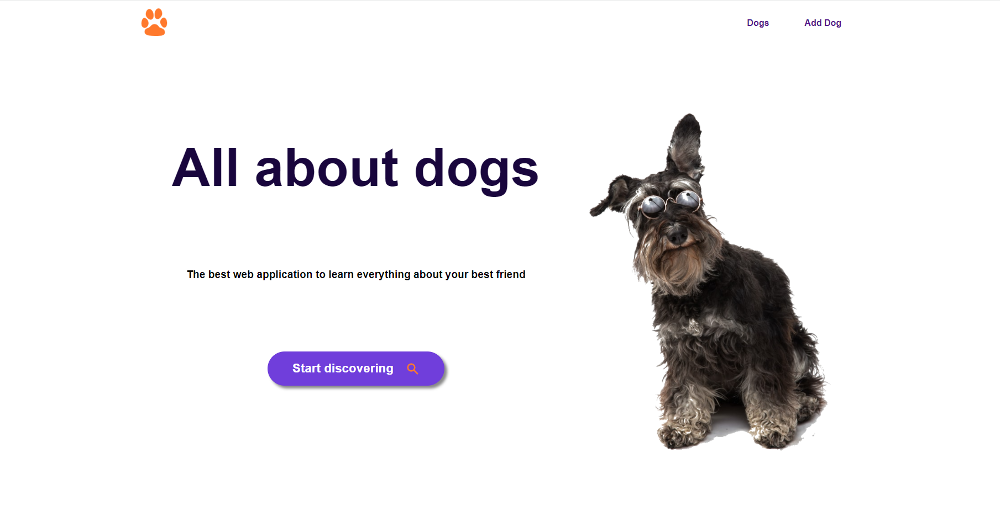
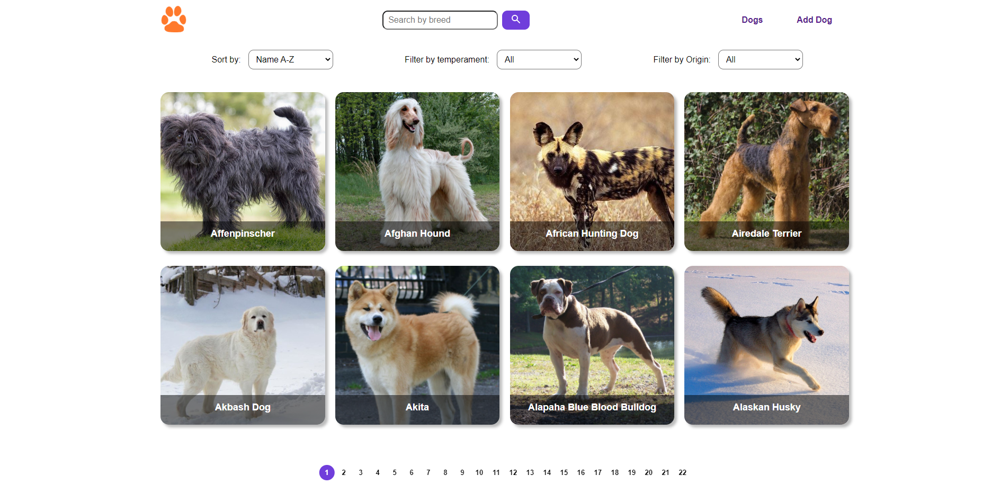
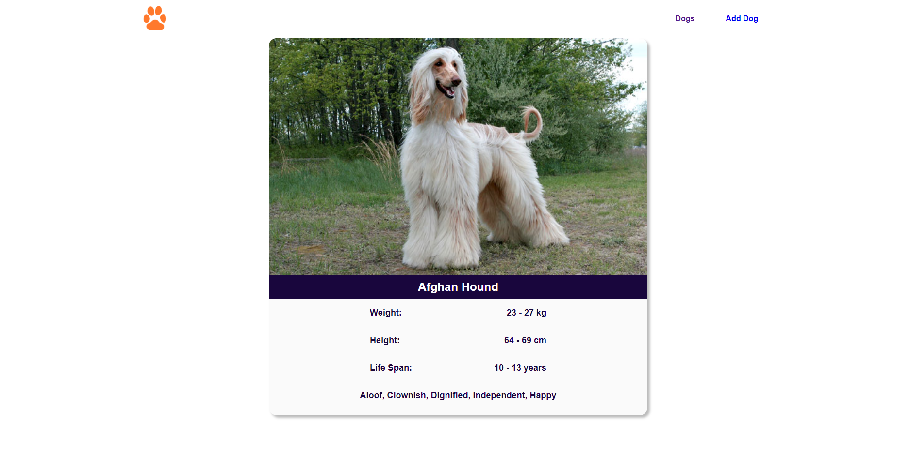
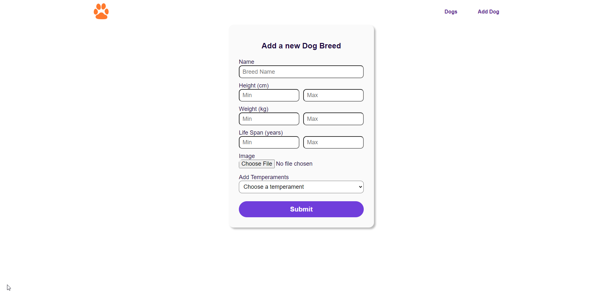

<p align=''>
    
</p>

# Dogs App

<p align="left">
  
</p>

## General info

Dogs App is a Full Stack Web Application that allows you to search, sort, and filter information about hundreds of different dog breeds and even lets the user add their own dog breeds.

You can follow the setup instructions below to run this project in your own machine or you can see the live site in this [link.](https://dogsdemo.herokuapp.com/)

## Technologies

### Frontend

- **React.js**
- **Redux:**
- **CSS** (Only pure CSS was used for styling as it was a requisite for this project)

### Backend

- **Express.js**
- **Sequelize**
- **PostgreSQL**

### Testing (Unit testing)

- **Jest**
- **Chai**

## Features

### Home

<p align="left">
  
</p>

The Home page welcomes you to the website and has a button and navigation bar to explore the website

### Main

<p align="left">
  
</p>

- **Pagination:** Pages are automatically created according to how many breeds are found and you can navigate through them with a click.

- **Search by name:** Making use of a redux state and an unbounced local state, the dogs are filtered by breed name 200ms after a change in the search bar is made or when the search button is clicked.

- **Filtering and sorting:** You can filter by temper or origin (whether they are from The Dogs API or created by users) and sort by name or weight. You can even use all the filters and sorters at the same time.

### Dog Detail

<p align="left">
  
</p>

By clicking in any dog you can see the detailed information about that breed

### Add Dog

<p align="left">
  
</p>

This page has a controlled form the user can fill to create a new dog breed, all the fields are required.

The user can even add an image to the dog breed, for this feature **Cloudinary** was implemented

## Setup

1. Clone the repository
   ```
   git clone https://github.com/javlopezdi/PI-Dogs-main.git
   ```
2. Set up a PostgreSQL Database
   
   For this you can download the software in the [PostgreSQL website](https://www.postgresql.org/download/) and follow the instructions there to set up a database
3. Set up the environment variables
   
   Once you hace your database ready, you must create an `.env` file in your root folder and make sure you have these variables with your own information. In order to get the `DOG_API_KEY` you just have to register in [The Dog Api](https://www.thedogapi.com/)
   ```
   DB_USER=<your-postgres-user>
   DB_PASSWORD=<your-postgres-password>
   DB_HOST=localhost
   DOG_API_KEY=<your-dog-api-key>
   ```
4. Install the dependencies
   ```
   npm install && cd client && npm install
   ```
5. Build the React app
   ```
   cd client && npm run build
   ```
6. Run the project!
   ```
   npm start
   ```

